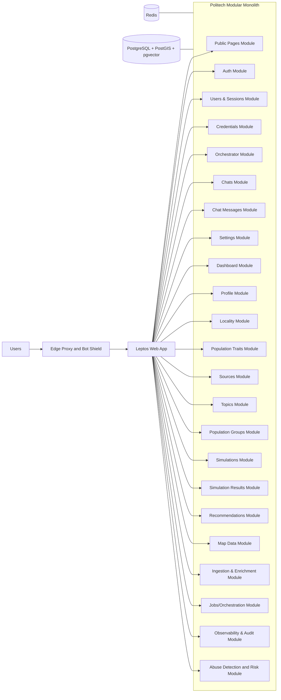
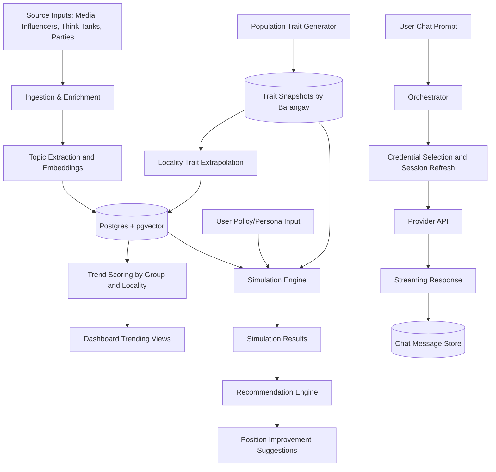
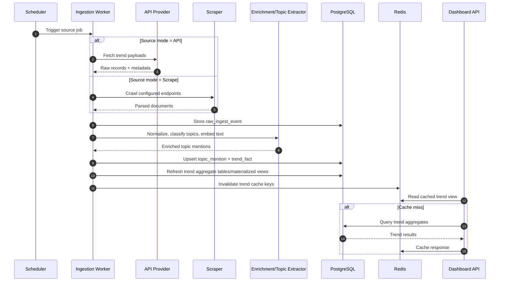
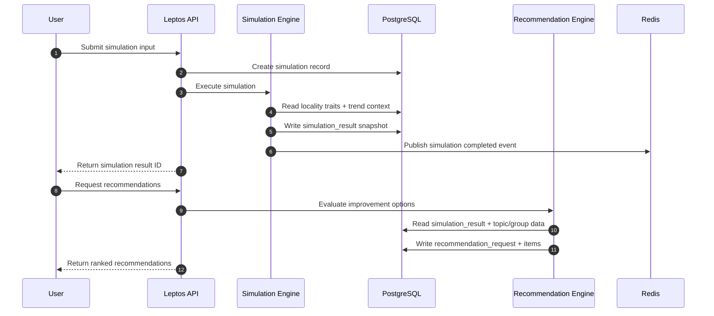
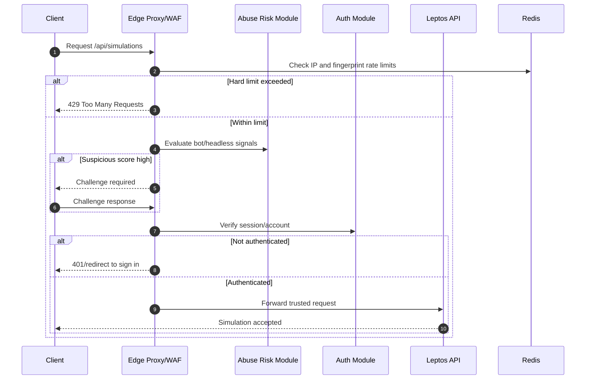
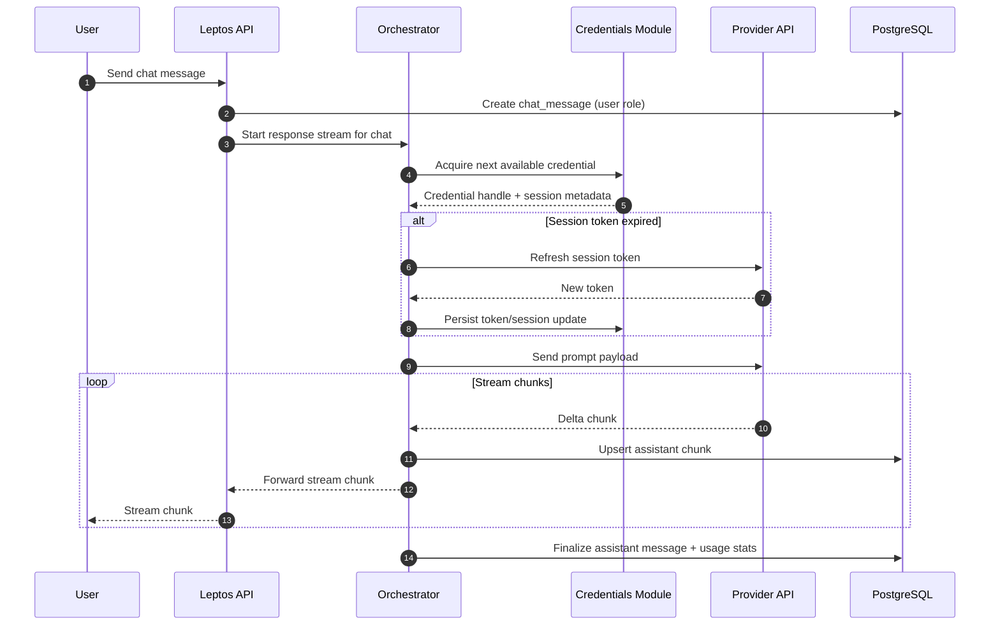
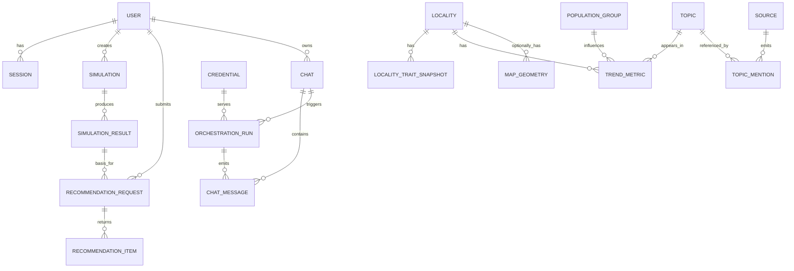

# Politech Product Requirements Document (PRD)

## 1) Product Overview
Politech is a geospatial political intelligence and simulation platform for the Philippines. It helps users understand trending topics among population groups, simulate persona/policy alignment, and get recommendations for improving policy positions.

This PRD targets a **modular monolith** architecture to maximize development speed and maintainability while preserving clear module boundaries for future extraction to services.

## 2) Goals and Non-Goals

### Goals
- Enable fast product iteration using `Leptos` (Rust) with a single deployable web app.
- Provide geospatial and vector-enabled analytics in `PostgreSQL` (with PostGIS + pgvector).
- Support simulation creation, sharing, and comparison across multiple runs.
- Surface trending topics for common and dynamic population groups.
- Provide recommendation workflows that suggest position improvements.
- Maximize throughput and stability on a small VM footprint.

### Non-Goals (v1)
- Full microservices decomposition.
- Real-time nationwide stream processing at web-scale.
- Perfectly accurate political prediction; this is a decision-support tool.

## 3) Target Users
- Policy strategists and campaign teams.
- Civic researchers and analysts.
- Public users exploring political personas, topics, and locality behavior.

## 4) Core Product Features

### 4.1 Trending Topics by Group
- Users can view trending topics for predefined and dynamically formed population groups.
- Trends can be filtered by time range, locality, source type, and confidence score.
- Users can inspect per-topic analytics:
  - Volume and growth rate
  - Sentiment distribution and sentiment trend
  - **Alignment map:** geographic distribution of how well a topic (or political persona, or policy) aligns with population traits per locality, on a **1–10 dislike–meh–like** scale.

### 4.2 Simulation Studio
- Users create simulations for:
  - Political personas (trait vectors).
  - Policies/messages (policy vectors).
- The system computes alignment between personas/policies and population traits.
- Users can save, rerun, and share simulations.

### 4.3 Recommendation Engine
- Users request recommendations to improve policy/persona positioning.
- System returns:
  - Suggested trait adjustments.
  - Topic framing improvements.
  - Locality-specific strategy hints.

### 4.4 Geospatial Insight (Alignment Maps)
- Locality-level insights across barangays, towns, districts, provinces, and regions.
- **Alignment maps** show the geographic distribution of resonance between:
  - A **topic** (trait vector derived from topic), or
  - A **political persona** (trait vector), or
  - A **policy/message** (trait vector)
  and each locality’s population trait vector.
- Map values use a **1–10 scale**: 1 = dislike / low alignment, 5 = meh / neutral, 10 = like / high alignment.
- Same scale and computation for topic, persona, and policy maps; users can compare distribution of “sentiment” (alignment) across the map.

## 5) Functional Requirements

### 5.1 Auth and Identity
- Email/password and OAuth login.
- Session management with secure cookies/tokens.
- RBAC roles: `public`, `user`, `analyst`, `admin`.

### 5.2 Users, Sessions, and Profiles
- User profile management and personalization settings.
- Session audit trail and device/session revocation.

### 5.3 Locality and Population Trait Modeling
- Store official locality hierarchy:
  - Barangay -> Town/City -> District -> Province -> Region.
- Maintain barangay-level sample population with extrapolated personality traits.
- Allow trait regeneration jobs with versioning.
- Aggregate traits upward to higher locality levels.

### 5.4 Sources and Topic Intelligence
- Sources DB includes media outlets, influencers, think tanks, and political parties.
- Topics DB supports canonical topics, aliases, and taxonomy hierarchy.
- Topic trend scoring pipeline by locality, source, and group.
- Topic analytics endpoints must expose:
  - `topic_stats` (mentions, unique sources, growth, confidence)
  - `topic_sentiment` (positive/neutral/negative mix and trend over time)
  - **Alignment map metrics:** locality-level alignment scores for **topics**, **political personas**, and **policies**, computed from persona-trait alignment (message/persona vector • locality population vector), displayed on a **1–10 dislike–meh–like** scale.

### 5.4.1 Trend Ingestion Capability (Scraping + API Providers)
- The platform supports two ingestion modes:
  - **API provider ingestion** (preferred when available): official APIs, data vendors, and social listening providers.
  - **Web scraping ingestion** (fallback or supplement): crawlers/parsers for public pages and feeds.
- Each source configuration must declare:
  - Ingestion mode (`api` or `scrape`)
  - Poll schedule / rate limit
  - Coverage metadata (topic domains, locality relevance, language)
  - Legal/compliance flags (terms, robots constraints, allowed fields)
- Data quality controls:
  - Deduplication by content hash + source external ID.
  - Confidence scoring per mention (source reliability + extraction certainty).
  - Quarantine queue for malformed/low-confidence payloads.

### 5.5 Population Groups
- Seed common labels (for example: Duterte Supporters, Leni Supporters, BBM Supporters).
- Dynamic group creation when activity/volume threshold is reached.
- Group lifecycle management (active, merged, deprecated).

### 5.6 Simulation Management
- Create simulation definitions with:
  - Persona/policy inputs.
  - Selected localities and groups.
  - Parameter settings.
- Persist each run as a separate simulation result snapshot.
- Compare multiple simulation runs.
- Share simulation links with permission controls.

### 5.7 Recommendation Requests
- Users can submit recommendation requests against:
  - A simulation result.
  - A draft policy/persona.
- Return ranked recommendations with rationale and expected impact.

### 5.8 Dashboard and Public Pages
- Public pages for product info, use cases, and sign-up funnel.
- Authenticated dashboard for trends, simulations, and recommendations.

### 5.9 Abuse Prevention and Account-Gated Access
- High-value endpoints (trends, simulation create/run, recommendation request) require authenticated accounts.
- Anonymous traffic is limited to low-cost public pages and strict per-IP quotas.
- Progressive trust model:
  - New accounts: conservative rate limits and stricter challenges.
  - Established accounts: higher limits based on behavior/reputation.
- Bot and automation defenses:
  - Device fingerprint signals, header heuristics, and behavioral anomaly checks.
  - Step-up challenge flow for suspicious traffic (captcha/challenge page).
  - Session hardening with short-lived tokens and rotating refresh credentials.
- Scraper resistance:
  - Signed API requests for internal clients.
  - Endpoint-specific rate limits (IP + account + device tuple).
  - Honey endpoints and tarpitting for abusive patterns.

### 5.10 Credentials Module
- Securely store provider credentials used for upstream AI/chat providers.
- Support multiple credentials per provider/account with lifecycle states:
  - `active`, `cooldown`, `rate_limited`, `disabled`, `expired`.
- Secret material is encrypted at rest and never returned in raw form to UI clients.
- Track health and capacity metadata (last success/failure, quota hints, retry_after).

### 5.11 Orchestrator Module
- Route each chat/request to the next available credential based on:
  - Provider compatibility
  - Credential health and cooldown state
  - Fair usage balancing and quota headroom
- Orchestrator responsibilities:
  - Create/refresh provider session token when required.
  - Build/send prompt payload to selected provider.
  - Stream response chunks back to the client.
  - Retry on transient failures using alternate credentials when safe.
- The orchestrator is reusable for other async AI workloads beyond chats.

### 5.12 Chats Module
- Create and manage chat threads tied to users and optional workspace context.
- Store chat-level metadata (title, model/provider preference, visibility, status).
- Support soft-delete and archival.

### 5.13 Chat Messages Module
- Persist ordered chat messages with roles (`system`, `user`, `assistant`, `tool`).
- Store streaming chunks and finalized message content.
- Track token/cost usage and provider metadata per message or response segment.
- Support idempotent writes to prevent duplicate streamed chunks.

## 6) Non-Functional Requirements
- **Performance:** P95 dashboard load < 2.5s for cached data paths.
- **Scalability:** Modular boundaries support future service extraction.
- **Security:** OWASP controls, encrypted secrets, strict access checks.
- **Reliability:** Scheduled jobs are idempotent and retry-safe.
- **Auditability:** Track data lineage and simulation version provenance.
- **Cost Efficiency:** Run core workload on a small VM via aggressive caching, pre-aggregation, and async job execution.
- **Abuse Resilience:** Multi-layer anti-DDoS/anti-bot controls with graceful degradation under attack.

## 7) Technical Architecture

### 7.1 Core Stack
- **Web App:** `Leptos` (Rust) for SSR UI + API handlers.
- **Styling:** `Tailwind CSS` with a **Salesforce CRM-inspired design system** (tokenized spacing, typography, color roles, table/form patterns).
- **Primary DB:** `PostgreSQL` with:
  - `PostGIS` for geospatial.
  - `pgvector` for embeddings and semantic similarity.
- **Cache/Queue:** `Redis` for caching, rate limiting, ephemeral queues, and pub/sub.
- **Workers:** Rust workers for simulations/recommendations; optional Go workers for high-concurrency scraping connectors.
- **Edge/Ingress:** Reverse proxy with TLS termination, connection limits, and L7 rate limiting (for example Cloudflare or Caddy/Nginx stack).
- **Deployment shape:** Single modular monolith app process + worker processes tuned for small VM operation.

### 7.2 Modular Monolith Diagram

### 7.3 Data/Compute Flow Diagram

### 7.4 Module Dependency Rules
- UI-facing modules call domain modules through typed interfaces.
- Domain modules can only depend on shared kernel packages and approved upstream modules.
- Cross-module writes require explicit application service boundaries.
- Background jobs are the preferred integration method for heavy processing.

### 7.5 Sequence Diagrams

#### 7.5.1 Trend Ingestion (API/Scrape -> DB -> Dashboard)

#### 7.5.2 Simulation and Recommendation Request

#### 7.5.3 Request Protection and Account Gating

#### 7.5.4 Chat Orchestration and Stream Routing

### 7.6 Small VM Capacity Profile (Serve as Many as Possible)
- Recommended baseline shape:
  - 1 Leptos app process (async runtime, bounded worker threads)
  - 1 background worker process for simulation/recommendation jobs
  - Managed PostgreSQL and Redis when possible (or separate VM if self-hosted)
- Capacity tactics:
  - Cache hot trend queries in Redis with short TTL and stale-while-revalidate.
  - Precompute hourly/daily trend aggregates; avoid expensive live group-bys.
  - Queue heavy simulation jobs and return async status for long-running work.
  - Apply backpressure: reject or defer requests when queue depth is high.
- Resource guards:
  - Per-endpoint concurrency limits and request timeouts.
  - DB connection pool caps to prevent VM memory exhaustion.
  - Circuit breakers for external providers to avoid cascading failures.

## 8) Modules (Detailed)

### Required Modules from Request
- Public Pages (website)
- Auth
- Users and Sessions DB
- Settings
- Dashboard
- Profile
- Locality Databases (barangays, towns, districts, provinces, regions)
- Barangay-level sample population with regenerable extrapolated traits
- Locality trait extrapolation
- Sources DB
- Population Groups (seeded + dynamic threshold-based)
- Topics DB
- Map Data (optional at start, recommended for map UX)
- Simulations
- Simulation Results (multiple simulations)
- Credentials
- Orchestrator
- Chats
- Chat Messages

### Additional Recommended Modules
- **Ingestion & Enrichment:** Collect and normalize source data.
- **Entity Resolution:** Merge duplicate sources/topics/entities.
- **Recommendation Engine:** Improve user position/policy framing.
- **Search & Discovery:** Full-text + semantic search across topics/results.
- **Notification Module:** Async notifications for finished simulations.
- **Feature Flags/Experiments:** Safe rollout of model and UX changes.
- **Observability & Audit:** Logs, metrics, tracing, lineage, compliance events.
- **Abuse Detection & Risk:** Bot scoring, rate policy decisions, and challenge orchestration.
- **Admin/Moderation:** Manage sources, thresholds, groups, and abuse controls.
- **API/SDK Boundary Module:** Stable internal API surface for future clients.
- **Provider Adapter Module:** Standardize calls across multiple chat/LLM providers.

## 9) Data Model (High-Level)

### 9.1 Trend Storage Strategy in PostgreSQL
- Use a layered storage model so ingestion is flexible and analytics stay fast:
  - **Raw layer:** immutable source payloads for replay/audit.
  - **Normalized layer:** clean mentions and linked entities.
  - **Serving layer:** pre-aggregated trend metrics for UI queries.
- Proposed core tables:
  - `source_config` (provider/scraper settings, limits, coverage, compliance flags)
  - `raw_ingest_event` (source payload JSONB, fetch timestamp, checksum)
  - `topic_mention` (normalized mention text, topic ID, sentiment, source ID, locality hint)
  - `mention_embedding` (pgvector for semantic similarity/dedup support)
  - `trend_fact` (atomic scored events by topic/group/locality/time-bucket)
  - `topic_sentiment_fact` (sentiment events by topic/locality/time-bucket)
  - `trend_aggregate_hourly`, `trend_aggregate_daily` (materialized or table-based aggregates)
  - `topic_stats_daily` (precomputed topic KPI snapshot for dashboards)
  - `alignment_map_metric` (per-locality alignment for topic/persona/policy; `alignment_1_10` = 1 dislike–10 like)
  - `topic_map_metric_daily` (optional intensity-only locality metric per topic)
- Partitioning/indexing:
  - Time-partition `raw_ingest_event`, `topic_mention`, and `trend_fact` by day/month.
  - Composite indexes on `(topic_id, locality_id, bucket_ts)` and `(group_id, bucket_ts)`.
  - GIN index on JSONB metadata and ivfflat/hnsw index for vectors.
- Retention:
  - Keep raw payloads shorter (for example 30-90 days), keep normalized/aggregated longer.
  - Archive old partitions to cold storage when needed.

## 10) Alignment and Recommendation Logic (v1)
- Represent personas, policies, and topics (as trait/message vectors) and locality populations as trait vectors.
- Compute baseline alignment (resonance) per locality: e.g. dot product or weighted similarity between message/persona vector and locality population vector.
- **Map display scale:** normalize internal resonance to **1–10 (dislike–meh–like)** so topic, persona, and policy maps share the same interpretation (1 = low alignment, 5 = neutral, 10 = high alignment).
- Estimate sensitivity by varying top traits and recomputing outcomes.
- Generate recommendations based on highest-impact adjustable traits.
- Store feature contributions and alignment map metrics for explainability.

## 11) API Surface (Initial)
- `POST /api/auth/*`
- `GET /api/credentials`
- `POST /api/credentials`
- `PATCH /api/credentials/:id`
- `POST /api/chats`
- `GET /api/chats/:id`
- `POST /api/chats/:id/messages`
- `GET /api/chats/:id/stream`
- `GET /api/trends`
- `GET /api/topics/:id/stats`
- `GET /api/topics/:id/sentiment`
- `GET /api/topics/:id/map`
- `GET /api/personas/:id/map`
- `GET /api/simulations/:id/map` (or policy map)
- `GET /api/groups`
- `GET /api/localities`
- `POST /api/simulations`
- `GET /api/simulations/:id`
- `GET /api/simulations/:id/results`
- `POST /api/recommendations`
- `GET /api/recommendations/:id`

## 12) Rollout Plan

### Phase 1: Foundation
- Auth, users/sessions, locality hierarchy, base dashboard shell in Leptos.
- Tailwind setup + Salesforce CRM-inspired design tokens/components (app shell, nav, table, form, card).
- Source/topic ingestion baseline.
- Edge rate limits, account-gated API access, and baseline anti-bot challenge flow.
- Credentials module and orchestrator skeleton with health-aware routing.

### Phase 2: Trends and Groups
- Trending views by common groups + dynamic group thresholding.
- Locality drill-down and map integration.

### Phase 3: Simulations
- Simulation creation, run execution, and result snapshots.
- Sharing and comparison.

### Phase 4: Recommendations
- Recommendation requests + ranked suggestions with rationale.
- Feedback loop for recommendation quality.

## 13) Success Metrics
- Weekly active users on dashboard.
- Number of simulations created per active user.
- Recommendation acceptance/use rate.
- Median time from simulation request to result.
- Trend relevance rating from users.

## 14) Risks and Mitigations
- **Data quality risk:** Build source confidence scoring and audit tooling.
- **Model trust risk:** Expose rationale and contribution breakdowns.
- **Performance risk:** Use Redis caching and pre-aggregated trend tables.
- **Scope risk:** Enforce phase gates and module-level acceptance criteria.

## 15) Open Questions
- Exact threshold logic for dynamic population group creation.
- Sharing permissions model (private, org, public).
- Minimum viable map layer requirements for v1.
- Frequency and governance for trait regeneration jobs.
